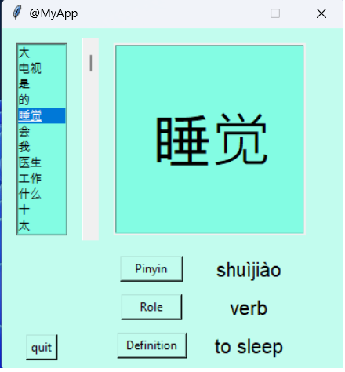

# Chinese Flashcards

## 🛠️ Description

A tkinter application which displays chinese characters.

+ click on the characters from the list.
+ click on one or more button (pinyin, role, definition)

The characters come from the HSK1 list (non official).

More informations on [pinyin](https://en.wikipedia.org/wiki/Pinyin).

More informations on [HSK](https://en.wikipedia.org/wiki/Hanyu_Shuiping_Kaoshi).

## ⚙️ Languages or Frameworks Used

+ beautifulsoup4==4.11.1
+ requests==2.28.1
+ python 3.10.6

## 🌟 How to run

Move to the app folder.
```sh
cd app
```
Run the main file.
```sh
python main.py
```

## 📺 Demo

